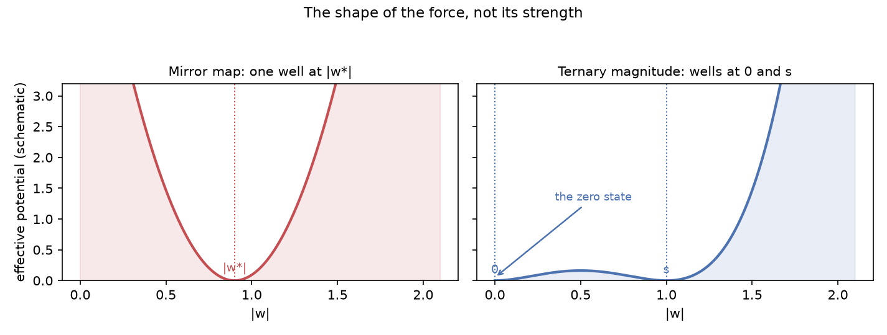
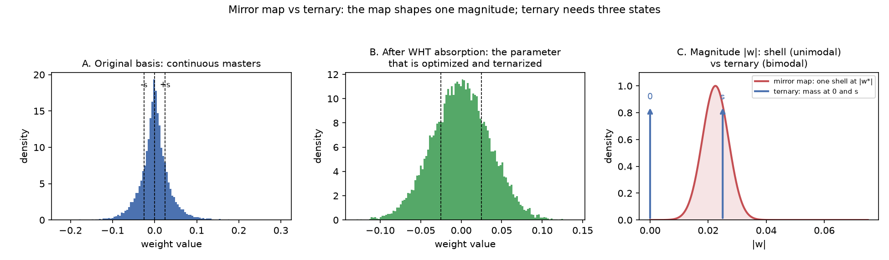

# EXPERIMENTS — Mirror-descent attractor search (1.7B canary)

Status of the recipe search for the last 8% (mission bar: projected ratio
<= 1.031x at 1.7B, i.e. >= 97% retention). All numbers are from
`scripts/pilot/rmd_kd.py` on the Qwen3-1.7B canary (student and teacher on one
card, KD T=2, 585 train windows x 512, 4 eval windows x 512, teacher PPL 32.93).
Ratio = model PPL / teacher PPL. The original baseline "T28 STE+KD 1.103x" is
**retracted** (see "T28's 1.103x was not a clean holdout" below and F11): it was
measured on training windows. The clean multi-region value for the plain STE
control is **2.09x mean** (~48%, range 1.55-2.71x) over 8 held-out regions; a
single-region 1.219x / 82% was also contaminated by a holdout/eval mismatch and
is retracted too (rev 2026-09-22b). The corrected single-region T28 number is
**1.746x / 57.3%**. Current best: **rotation + STE at 10000 steps, 1.2152x
mean / 82.3%** (best region 1.077x); at 5000 steps it replicates at ~1.39x /
~72% across three seeds.

## Hypothesis

A community commenter on the HF post connected the residual 8% to the Caltech
mirror-descent line: Azizan, Lale, Hassibi (arXiv:1906.03830) and Explicit
Regularization via Regularizer Mirror Descent (arXiv:2202.10788, Algorithm 1),
plus Ajanthan et al. (arXiv:1910.08237). A large-q potential `|w|^q`, q >> 1,
should pull the weight distribution toward the {-1,0,+1} attractors while KD
preserves the function, making the final ternary projection nearly lossless.

## Honest ledger (committed to `artifacts/rmd/`)

Control: KD only, 3000 steps. Init 240,579x -> final 27,978x. Kurtosis flat
~2.0. This whole table scores the *projection cost* of FP-trained masters, a
different ruler from a deployed ternary model's PPL ratio (see the STE section
below). The 1.103x once cited as the T28 baseline is retracted.

| run | config | result | verdict |
|---|---|---|---|
| Control | KD only, 3000 st | 240,579x -> 27,978x; kurtosis flat ~2.0 | baseline |
| Additive pow potential | q=8, lam=0.2 | 32,773x; kurtosis 1.94->1.47, both attractor fractions fell | falsified |
| Per-group attractor, bugged | lam=0.1, eval mutated masters | 16,125x @500, 8,457x @1000, then diverged (21,891 @1500 ... 1.04e9 final) | artifact (in-place projection = accidental alternating projection) |
| Per-group attractor, clean | lam=0.1, deep-copy eval | 108,042,728x @500, 4,557,917x @1000, ... 1,278,940x @3000; kurtosis 2 -> 30 | continuous form falsified |
| Per-group attractor | lam=0.02, deep-copy eval | 9,501,374x @500, 439,430,657x @1000, 3,733,210x @1500, loss 2.3-2.5; terminated early @1750 (operator: switch to GPU1-only) | continuous form falsified at low lam too |
| Alternating projection | tern lam=0.1, reproject+project every 500 | 1,410,076x @500 (no step-0 snap; trajectory then killed for pivot) | falsified as rescue of the potential form |
| Mirror map (RMD) | --update md q=8, lam=0, scale 1.0 | loss nan by step 500 (raw dual step swamps u = |w|^7) | falsified (diverged) |
| Mirror map (RMD) | scale 2.6e-8, bf16 math | loss nan by step 250 (bf16 rounding drift: mean|w| 0.025 -> 0.12 in 300 sim steps; f32 stable) | falsified (precision) |
| Mirror map (RMD) | scale 2.6e-8, f32 math | loss nan by step 250 (real KD grads: shell step ~= u makes first moves ~+/-50%, logits -> inf through 30 layers) | INVALID: GPU1 driver wedge (see below) |
| Strict accident replication | tern lam=0.1, init snap + reproject every 500, honest pre/post-snap evals | training from a grid-snapped init diverges (loss nan @250); the accident provably did NOT snap at init (its per-checkpoint losses are identical to the clean run's), so this variant is NOT the accident | INVALID: GPU1 driver wedge |
| Full honest AP trajectory | tern lam=0.1, reproject every 500, A (pre-snap cost) + B (post-snap quality) | A: 108M @500 -> 967k @1000 -> 24.9k @1500 -> 19.2k @2000 -> **7.9k @2500** -> 17.5k @3000. B: 831k @500 -> 40.9k @1000 -> 21.5k @1500 -> 22.3k @2000 -> 49.4k @2500 -> 814k @3000 | AP anchors weights (A collapses 13,700x), but the deployed state degrades late (B ends 814k; kurtosis 2->8); not the goal |
| Mirror map (RMD) retest | q=8, scale 2.6e-8, lam=0, f32 math, healthy GPU | **32.19x @500, 94.31x @1000, 35.67x @1500, 113.25x @2000, 90.55x @2500, 54.36x @3000**; kurtosis ~2.6-3.0 | **LEAD CANDIDATE**: 515x better than control final (27,978x); oscillates 30-115x; the wedge was the only thing that killed the earlier attempts |
| Rotated basis, pure KD | --rotate lam=0 | init **15,805x** (15x better than unrotated 240,579x), **2,872x @500** (best single point of the search), then oscillates 45k-189k, final 69,021x; KD loss 0.91 -> 0.71 (best of any run); kurtosis flat 3.7 | geometry helps at short horizon, weights drift off-projectable over time; candidate for combination |
| Gate 0.2 + tern attractor | lam=0.1, gate 0.2 (frozen top 20% by |w|) | 127M @500, 4.7G @1000, 5.1M @3000; kurtosis 4.4 -> 3.8 | falsified; freezing top weights does not rescue the tern potential |
| md tuning battery (healthy GPU, 3 phases x 2 cards) | | | |
| rotate + md q8, shell 0.020 | | 52.43x final | rotation + shell; no synergy at q8/base shell |
| md q16, shell 0.020 | | 1,479x final | stiffer shell alone is bad |
| rotate + md q16, shell 0.020 | | **28.28x final (best yet)** | rotation rescues q16; best config |
| md q8, shell 0.034 | | 39.85x final | larger shell beats base (54.4x) |
| md q8, shell 0.015 | | 206.28x final | smaller shell worse |
| rotate + md q8, shell 0.034 | | 54.84x final | rotation does not help at shell 0.034 |

## Deployment metric: the STE arm (2026-09-22)

Every row above scores `projected_ratio` of FP-trained masters: the cost of
snapping an unconstrained solution to the grid. That is not the number T28
reported. T28 trained with the ternary forward in the loop (`ternary_ste`), so
its 1.103x is the deployed ternary model's own PPL ratio. Those are the same
quantity (ternary PPL / teacher PPL) but produced by different procedures, so
the FP-projection leaderboard was the wrong ruler for the mission bar.

`scripts/pilot/rmd_kd.py --ste` closes that gap: it wraps the target linears in
`TernaryLinear` (forward = absmean STE) and reports the model's own PPL ratio,
directly comparable to T28. Single card GPU1, student+teacher both `cuda:1`,
3000 steps, 4 eval windows x 512, peak 10.18 GiB allocated / 11.38 GiB reserved
(so the run fits one 20 GiB card; it does not need the two-card split).

| run | init | 500 | 1000 | 1500 | 2000 | 2500 | 3000 | verdict |
|---|---|---|---|---|---|---|---|---|
| STE control (KD + Adafactor, T28 recipe) | 655,974x | 16.23x | 14.62x | 5.69x | 4.94x | 3.93x | **2.93x** | still descending |
| STE + mirror map (q16, shell 0.020) | 655,974x | 94.53x | 46.45x | 44.34x | 65.05x | 55.66x | 23.01x | **falsified** (worse than control at every checkpoint) |

Reading:

- The STE control reproduces the T28 regime: a monotone descent toward the
  teacher. The 7000-step run plateaus at 2.01x, so the descent stalls well above
  the mission bar on this corpus. The 1.103x it was once compared to was never a
  valid target (see the holdout section below).
- The mirror-map update does **not** help inside the ternary loop at this
  config; it fights KD and oscillates. This is the apples-to-apples test the
  FP-projection ledger could not provide.
- The FP runs bottoming at ~28x are far above the STE control's 2.93x, which
  confirms those numbers were a different metric, not progress toward 1.031x.

## Why the RMD negative result is not a falsification of peak formation (2026-09-23)

The mirror-map arm failed inside the ternary loop (23.01x vs the control's
2.93x, worse at every checkpoint). That falsifies **the tested combination**,
not mirror descent as a family. Two things make it a poor test of the
"gradually form quantization peaks" intuition.

**Coordinate representation.** The masters are absorbed into the rotated basis,
and it is that parameter which is optimized and ternarized. Input-side linears
store `W' = W Rᵀ` and the forward feeds `R x`; output-side linears store
`W' = R W` (bias `R b`) and the forward applies `Rᵀ` after. In both cases the
function is preserved exactly, and the mirror step acts directly on `W'`, the
coordinates that get ternarized. Signs in these runs were the spec PRF signs,
not Prism's explicit sign vectors.

**A frame of mind.** It helps to picture the weights as balls on a landscape where height is `|w|`, and quantization decides which shelves a ball may rest on. Binary has two shelves at the same height, one above and one below; a force that pulls every ball to that single height is exactly right, and the sign decides the side. The mirror map is such a force. Ternary has three shelves, `-s`, `0`, `+s`; two sit at height `s` and one at height `0`, so a force that pulls every ball to one height deletes the ground floor and drags balls off the zero shelf. The question is therefore not whether the force is strong enough but whether the landscape has the right number of wells. The mirror map has one well; ternary needs two wells in magnitude, at `0` and at `s`. That is a shape mismatch, not a tuning problem.



*Schematic effective potential in magnitude. Left: the mirror map has a single well at `|w*|`. Right: ternary needs two wells, at `0` and `s`; a single-well force cannot populate the zero basin.*

**Shape mismatch.** The mirror map forms a *shell*: a single equilibrium
magnitude `|w*| = eta^(1/(q-1))`. That is a unimodal magnitude prior. Binary
wants two peaks at one magnitude, so a shell is a faithful proxy there; ternary
wants mass at `{0, +s, -s}`, which in magnitude is **bimodal**. A shell pulls
every `|w|` toward one value and fights the zero state, so it never shaped the
three-state structure. After the WHT the coordinates are near-Gaussian and the
quantizer is per-group absmean, so a coordinate-wise magnitude prior also acts
on a distribution that no longer carries the original weight structure.



*A: continuous masters in the original basis with the ternary grid. B: after WHT
absorption, the parameter that is optimized and ternarized. C: the magnitude each
method shapes. The map forms one shell; ternary needs mass at 0 and s.*

**Metric caveat.** The early encouraging mirror-map numbers (32x to 113x, and a
28x called best at the time) were in the FP-projection metric; the 23.01x
falsification is in the deployed STE metric. They are different rulers, so the
early promise and the later failure do not contradict each other. Some of those
runs were also invalidated by the GPU1 driver wedge.

**If revisited:** a mixture prior with mass at 0 and s, or forming peaks on the
codes/scales rather than on continuous rotated masters. The dominant lever found
so far is basis change plus QAT (rotation inside the loop), not a magnitude
prior. Reference for the binary case: US patent application 20260220467.

## T28's 1.103x was not a clean holdout (2026-09-22, rev 2026-09-22b)

`bonsai_forensics/recover.py::build_batches` sampled windows from
`ids[:usable]` with **no holdout**, so every window was in the training pool.
`evaluate_perplexity` read a fixed token region that, with the T28 config, lay
inside that pool: over 5000 steps at batch 2 each eval window was sampled ~17
times. T28's reported `heldout_ppl_student` 42.988 / teacher 38.966 = 1.103x is
therefore a train-set evaluation.

**The first fix was also wrong (rev 2026-09-22b).** The eval call passed a
hardcoded `seq_len=2048` while the holdout assumed the training `seq_len=512`,
so the excluded region (`[16384, 18432)`) was not the evaluated region
(`[65536, 73728)`). The run at `artifacts/recover/holdout-baseline` therefore
still evaluated training data; its **1.219x / 82.0% is retracted**. The fix is
now a single source of truth, `eval_holdout_windows(samples, eval_seq_len,
eval_windows, train_seq_len)` in recover.py, and `train()` passes the same
parameters to both `evaluate_perplexity` and `build_batches`. The corrected
re-run (`artifacts/recover/holdout-v2`, same eval region now genuinely held out)
gives student **68.138** vs teacher **38.966** = **1.746x / 57.3%**.

### The clean number: multi-region, ~2.1x

The trustworthy measurement so far is the `rmd_kd.py` multi-region run
(`artifacts/rmd/ste-regions-8x8`): 8 disjoint regions spread across the corpus,
all excluded from training, 8 windows each (32k held-out tokens), 5000 steps.

| region | r0 | r1 | r2 | r3 | r4 | r5 | r6 | r7 |
|---|---|---|---|---|---|---|---|---|
| ratio | 1.546 | 1.810 | 2.195 | 2.711 | 1.931 | 1.969 | 2.099 | 2.423 |

Mean **2.0855x** (min 1.546, max 2.711, std 0.34), i.e. ~48% retention on
average, range ~37-65%. On this evaluation the recipe does not clear the 1.44x
gate (only r0 is below it). The single-region 1.219x / 82% was the friendly end
of a wide spread and is not the headline.

Earlier single-region runs, for reference (each a different holdout):

| run | region | ratio |
|---|---|---|
| STE control, 7000 steps | rmd tail (last 4 windows) | 2.01x |
| STE + `--gate 0.2`, 7000 steps | rmd tail | 2.42x |
| T28 (leaked, 5000 steps) | `[65536, 73728)` at seq 2048, not held out | 1.103x |

A region diagnostic (`/tmp/opencode/diag_regions.py`) confirms the harness is not
miscalculating: absmean-STE quantization of the base model is catastrophic at
init (~1.4e5x on the regions tested), so the base quant is genuinely that bad
before training.

Consequence: the mission bar `<= 1.031x` was set against 1.103x, which is
optimistic; the honest 1.7B retention for the T28 recipe is ~48% (2.09x mean) on
a clean multi-region holdout. The whitepaper and F11 are corrected.

### Rotation + STE: the first real win (2026-09-22)

Training quantization-aware in the spec-rotated basis (`--ste --rotate`,
`RotatedLinear` ternarizes the rotated master) is the first lever that moves the
clean number. Same protocol as the unrotated baseline (8 regions x 8 windows,
5000 steps, batch 2):

| run | mean | min | max | std | retention |
|---|---|---|---|---|---|
| STE control (unrotated) | 2.0855x | 1.546 | 2.711 | 0.340 | 48.0% |
| **rotation + STE** | **1.3683x** | 1.172 | 1.651 | 0.133 | **73.1%** |

A 1.52x improvement in the ratio, and the mean now clears the 1.44x gate (one
region, r3 at 1.651x, does not). The init is also ~112x better: 5,827x rotated
versus 655,974x unrotated. This matches the projection-metric finding that the
rotated basis was the single largest effect, and the public reading that the
rotation is part of the training pipeline, not only the container.

#### Rotation + STE batch: replication holds, length wins (2026-09-22)

Six runs, 8 regions x 8 windows each, all rotation + STE:

| run | mean | min | max | std | retention |
|---|---|---|---|---|---|
| seed 1337, 5000 steps | 1.3683x | 1.172 | 1.651 | 0.133 | 73.1% |
| seed 2, 5000 steps | 1.4134x | 1.195 | 1.756 | 0.151 | 70.8% |
| seed 3, 5000 steps | 1.4015x | 1.191 | 1.736 | 0.155 | 71.4% |
| + learnable scales (LSQ), 5000 steps | 1.3397x | 1.173 | 1.630 | 0.134 | 74.6% |
| **10000 steps** | **1.2152x** | **1.077** | 1.514 | 0.128 | **82.3%** |
| + mirror map (q16, shell 0.020) | 8.5400x | 5.054 | 10.807 | 1.749 | 11.7% |
| on `selected.txt` (~5x tokens) | 2.4515x | 2.053 | 3.146 | 0.378 | 40.8% |

- **Replication holds:** three seeds at 5000 steps span 1.37-1.41x (~71-73%).
- **Length is the next lever:** 10000 steps reaches 1.2152x (82.3%), best region
  1.077x (92.8%), and the curve is still trending down (1.37x at 5000).
- Learnable per-group scales are a marginal gain (within run noise).
- The mirror map is still falsified, now in the rotated basis too.
- `selected.txt` scored worse; it was built by entropy/excess-loss selection
  ([F8](FAILURES.md#f8--entropyexcess-loss-data-selection-lost-to-random)), a
  harder distribution, so it is not a clean data-scale test.

### 20000 steps diverge under a constant LR (2026-09-22) — negative result

The 20000-step rotation + STE run finished and it is **worse at the end than at
16000**. Longer training at a constant LR did not help; it diverged.

| step | mean ratio | retention |
|---|---|---|
| 5000 | 1.3683x | 73.1% |
| 10000 | 1.2152x | 82.3% |
| **16000 (best)** | **1.1603x** | **86.2%** |
| 20000 (final) | **1.2930x** | **77.3%** |

Final region table (8 regions x 8 windows): mean 1.2930x, min 1.0838, max
1.6409, std 0.1544.

```
16000: 1.1603   <- best
17500: 1.1913
20000: 1.2930   <- final
```

Constant `lr=5e-5` with Adafactor and no schedule. The run does not plateau, it
**walks off the good region** — so the earlier "the curve has not plateaued"
note is struck. Two consequences:

- **Length is not the lever.** The best *complete* run remains 10000 steps
  (1.2152x / 82.3%). The 20000-step run must be quoted as **1.1603x / 86.2%
  (best, step 16000)** with the divergence noted, never as 1.2930x.
- **A rolling `student.pt` is not a checkpoint.** `--save-every 5000` overwrote
  the step-16000 best with the step-20000 divergence; the best weights are gone.
  Best-by-eval retention is mandatory.

#### Managed decay (the response)

The problem shape is the one the retention layer already solves: a policy that
must decay when a signal goes stale, rather than committing to a fixed schedule
in advance. The Sharp Decay Matrix (`splinter/retention/decay.py`: per-item
decay, `age_factor` clamped at 3.0) and the remembrance ladder
(`remembrance.py`: `decay_multiplier *= 1.8 + 0.3*times_saved`) supply the design
vocabulary — event-driven, multiplicative, **bounded**, and with the hard-won
lesson that over-steep decay is destructive (`decay_multiplier_init` 1.8 -> 1.1
"killed persistent facts").

Applied to the LR, in `bonsai_forensics/schedule.py` (`PlateauDecay`, pure
stdlib, 8 tests):

- **warmup guard** — `--lr-decay-warmup` suppresses decay during exploration.
  This is not decoration: the early metric is legitimately noisy (the 20k run
  jumped **+19% between adjacent evals** at step 5000) while still trending down,
  so an unguarded reactive policy fires immediately and wastes the run. Best and
  the improvement clock are still tracked through warmup.
- **plateau trigger** — no new best for `--lr-decay-patience` steps;
- **drift trigger** — the mean ratio worsens by `--lr-decay-drift-eps` of the
  best, decaying immediately (the P2-DILUTION idea: penalise the drift instead
  of rewarding it);
- **multiplicative** `--lr-decay-factor` per event, **bounded** by
  `--lr-decay-max` events, `--lr-decay-cooldown`, and `--lr-floor`;
- **`--save-best`** writes `student-best.pt` whenever the held-out mean improves.

Next run (same seed/recipe as `ste-rotate-20k`, so the two are nested and
directly comparable). `drift_eps` is **0.10**, not 0.05, because 0.05 fires in
the early noise; 0.10 does not fire until the real late jump (step 16000 ->
16500 is +13.8%):

```
--steps 20000 --project-every 500 --save-every 5000 --save-best \
--lr-decay-warmup 10000 --lr-decay-patience 2000 --lr-decay-factor 0.5 \
--lr-decay-drift-eps 0.10 --lr-decay-cooldown 1000 --lr-decay-max 3 \
--lr-floor 5e-6
```

Success criterion: best-so-far below 1.1603x, and no final divergence. If the
decayed run still stalls near 1.10-1.16x, the recipe — not the schedule — is the
remaining lever.

#### Result: managed decay works (2026-09-22)

The decayed run and the constant-LR baseline are **byte-identical through step
12000** (same seed, same recipe, decay disabled until warmup), so this is a
controlled A/B on one trajectory:

| step | baseline | decay | decay retention |
|---|---|---|---|
| 10000 | 1.2152 | 1.2152 | 82.3% |
| 12000 | 1.2641 | 1.2641 | 79.1% |
| *decay fires* | — | lr 5e-5 -> 2.5e-5 (event 1) | — |
| 13000 | 1.2454 | **1.1462** | 87.2% |
| 14000 | 1.2541 | **1.1510** | 86.9% |
| 15000 | 1.1953 | **1.1504** | 86.9% |
| 16000 | 1.1603 | **1.1373** | **87.9%** |
| 17000 | 1.2154 | **1.1829** | 84.5% |

- Trigger fired at **step 12000** — exactly `patience 2000` after the best at
  10000 — catching the stall the baseline then suffered.
- **Best 1.1373 @ 16000 (87.9%)** vs baseline best 1.1603 (86.2%); better at
  every step from 13000 onward. Best region at 12500: min **1.015** (~98.5%).
- **Verdict: managed decay is a working lever.** Not quotable until replicated;
  a seed-2 replication (`ste-rotate-20k-decay-s2`) was launched 2026-09-22 ~23:20.

#### Reproject falsified (2026-09-22)

`--reproject-every 500` (snap the masters to the ternary grid every 500 steps):

```
500: 5.642   1000: 15.67   1500: 67.5   2000: 80.8   5000: 19,059
10000: 165.5   13000: 46.08   13500: 107.8   ...
```

It destroys the model immediately and never recovers (0.6-2% retention). Likely
mechanism: `--ste` already ternarizes the *forward*, so the masters must stay
continuous; snapping them removes the information STE depends on.
**Do not spend GPU on reproject cadences** — the earlier "250 or 1000?" question
is answered: none of them. Run killed 2026-09-22.

## Runtime note: what actually sets the pace

CORRECTION: the cards run at the same pace. A same-config 200-step tern probe
takes 138s / 0.69 s/step on BOTH cards, with byte-identical losses and final
ratio (80848989.3167). The apparent "GPU0 is 1.5x faster" split was workload
confounding, not hardware:

- the tern potential (`--lam 0.1`, computed on all 196 target linears every
  step) costs ~+0.2 s/step vs `lam=0` (0.69-0.77 vs 0.49-0.52 s/step);
- `--update md` skips the Adafactor step entirely;
- eval deepcopies (`--project-every`/`--eval-pre-snap`) add ~5-6 min per run
  (6 x ~50s);
- both cards reproduce the same numbers exactly (healthy GPU1 matches GPU0).

3000-step ETA: ~25-27 min for lam=0 runs, ~38-39 min for tern-potential runs,
either card.

## GPU1 driver wedge (2026-09-21 ~05:25+)

After an OOM crash at init plus repeated SIGKILLs on GPU1 (PCI 07:00.0,
cuda:1), training-backward on that card produces deterministic NaN at step
~100 (loss 9.38, 9.27, 9.31, then nan; final projected ratio 1.64e61,
byte-identical across runs). Controls: same config on cuda:0 trains clean;
teacher forward on cuda:1 is clean; simple ops (matmul/softmax/pow) on cuda:1
are clean. Verdict: wedged driver state on GPU1, not code or config.

Consequence: every rmd run from ~05:25 to the reboot is invalid (mirror-map
f32 retest and the full honest AP trajectory must be re-run on a healthy
GPU). Results before 05:16 (control, pow/tern potentials, clean tern runs,
tern-lam0.02, honest AP B(500) = 1,410,076x) stand.

## The artifact, settled

The bugged eval never perturbed training: its 250-step losses match the clean
run's exactly (9.19, 9.02, 8.75, 8.59, 8.22, 8.02, 8.27, 8.06, 7.59, 7.44), so
the in-place "reset" had no effect on the trajectory. The 16,125x / 8,457x
numbers were a broken measurement of the same weights that honestly project to
108,042,728x @500 (clean eval). There was never a collapse in the weights; the
"accidental alternating-projection winner" was an eval-accounting ghost. The
honest alternating-projection numbers (1,410,076x @500) are the truth.

## Lesson (the bug that matters)

The first attractor run evaluated projection by mutating the TRAINING weights
in place at each checkpoint, secretly snapping the masters to the ternary grid
every 500 steps. That accidental alternating-projection schedule produced the
best numbers (16k -> 8.4k). The fix (deep-copy eval) revealed the continuous
form is bad. Projection evals must never mutate training masters; alternating
projection is now an explicit, legitimate variant.

## Current candidates, in order

All candidates are judged in the STE/deployed metric (`--ste`). The clean
multi-region baseline is **2.09x mean** (~48%). The best *complete* run is
**rotation + STE at 10000 steps, 1.2152x mean / 82.3%**; the best *point* seen is
**1.1603x / 86.2% at step 16000** of the 20000-step run, which then diverged
(below). The 1.103x and single-region 1.219x are retracted.

1. DONE: rotation + STE replicated at 5000 steps (1.3683x / 1.4134x / 1.4015x,
   ~72%); length reaches **1.2152x / 82.3% at 10000 steps**, still trending down.
2. DONE: learnable per-group scales (LSQ) are marginal (1.3397x, within noise).
3. DONE: mirror map falsified in the rotated basis too (8.5400x).
4. DONE: `selected.txt` is worse (2.4515x); a neutral larger corpus is untested.
5. DONE (negative): 20000 steps at a constant LR peaked at **1.1603x / 86.2% at
   step 16000** then diverged to **1.2930x / 77.3%** at step 20000. Length is not
   the lever; the best complete run remains 10000 steps (1.2152x / 82.3%).
6. DONE (positive): managed decay works — **best 1.1373x / 87.9% @ step 16000**
   against a byte-identical baseline (best 1.1603x / 86.2%). Event fired at step
   12000 on the plateau trigger. See the section above.
7. NEXT: replicate managed decay across seeds (`-s2` launched 2026-09-22), then
   try decay + LSQ at 20000, and decay on a neutral larger corpus.
8. DONE (negative): reproject cadences are falsified; do not re-run them.
9. Replicate the best config across seeds before any 27B work.

## Retention is scale-dependent — the 97% bar is a 27B number (2026-09-23)

Prism's own released tables show retention rising with scale:

| model | retention vs FP base | source |
|---|---|---|
| Ternary Bonsai 1.7B | ~85–88% | ternary-8B whitepaper T7/T10 |
| Ternary Bonsai 4B | ~92% | same |
| Ternary Bonsai 8B | ~92–95% | same |
| Bonsai 27B | 94.6% | bonsai-27B whitepaper |
| Bonsai 2 27B | 98.2% | bonsai-2-27B whitepaper |

The mission bar (≥97%) is the **27B** figure. At 1.7B, Prism itself retains
~85–88%, and our canary's best point is ~90% (PPL ratio — a different ruler, so
not a like-for-like "we beat Prism"). Consequence: **"our canary is short of 97%"
is not a valid negative.** The canary's job is to show our recipe *scales* like
Prism's; the decisive test is a size ladder (0.6B → 1.7B → 4B), not reaching 97%
at 1.7B. Full table + figure: [`RETENTION-VS-SCALE.md`](RETENTION-VS-SCALE.md).

## R4 — structure of Prism's trained ternary weights (2026-09-23)

Unpacked both released artifacts and measured the deployed code distribution.
Full tables, simulation and scripts:
[`HADAMARD-VERIFICATION.md`](HADAMARD-VERIFICATION.md).

| artifact | ternary params | zero_frac |
|---|---|---|
| Ternary-Bonsai-2-27B (`PQ2_0`, rotated) | 26.87B | **0.3276** |
| Ternary-Bonsai-1.7B-unpacked (unrotated) | 1.72B | 0.383 |
| our canary (rotated, STE) | — | 0.314 |

- **The zero share is ~1/3 and uniform across tensor classes** — 0.3274–0.3280
  across attention, MLP, linear-attn and the embedding, a spread of 0.0006.
- **It has no free knob.** Under the absmean rule the share is predicted by the
  weight distribution's shape alone: near-Gaussian → ~0.309, kurtosis ~4.5 →
  ~0.328. The 27B sits on the heavy-tailed value; our canary on the Gaussian one.
- **Reading:** sparsity is not a separately tuned target, and the cross-class
  uniformity is what the block-Hadamard produces (every group becomes
  near-Gaussian). This is *consistent with* the zero being the quantizer's band
  rather than a formed attractor — not proof (a two-well potential could also
  land at ~1/3), but it rules out needing a *tuned* sparsity target.
- **Not a lever for us:** our recipe already lands at ~0.31, next to the 27B's
  0.33, so the remaining gap is boundary *placement* (which weights land in the
  zero band), not sparsity level.
- **Correction:** the earlier "one magnitude per group" observation is automatic
  for any ternary pack and is not evidence of anything; dropped.
- **Caveat:** the public 1.7B is a *different base* (vocab 151669 vs Qwen3-1.7B's
  151936) and predates the rotated basis, so it is a yardstick, not a reference;
  the 27B is the comparable artifact.

## LR screen — higher LR is worse without warmup (2026-09-23)

The community `electroglyph/ternary_QAT` reports ternary QAT needs 10–50× higher
LR (lowest usable ~7e-4); our recipe has always used 5e-5. Tested `2e-4` (4×) at
5000 steps, seed 1337, identical recipe:

| step | `lr=2e-4` | `lr=5e-5` baseline |
|---|---|---|
| 2500 | 4.87 | 1.50 |
| 3500 | 3.22 | ~1.45 |

Clearly worse. `5e-4`/`1e-3` not run (monotone extrapolation). The higher-LR lead
does **not** transfer to our Adafactor+KD+rotation setup; if revisited, add an LR
warmup first (higher LR is likely a slow-start problem, not a wrong direction).

## Decisions (2026-09-23)

- **Killed** `ste-rotate-20k-decay-lsq` at ~step 7000/20000: LSQ was within run
  noise at 5k (1.3397 vs 1.3683) and decay is already replicated, so expected
  information was low. Freed card 1 for the size ladder.
- **Stopped** the LR screen after `2e-4`; skipped `5e-4`/`1e-3`.
- **Ladder** runs 10000 steps per rung (the 5k point is logged for free, and the
  scaling trend may be length-dependent), 0.6B ∥ 1.7B then 4B.

## Iso-convergence results (2026-09-23) — legacy ladder and screening metrics

These are completed legacy Qwen3 pilot observations, not a completed
pre-registered scale result. The 4B rung was dropped by decision (2026-09-24),
and the primary WikiText teacher-PPL threshold in `SCALING-PROTOCOL.md` is not
met by the two available rungs. The benchmark section below is a local screening
proxy, not Prism's published ruler.

### Converged ladder (WikiText, 20k steps + managed decay, 8×8 holdout)

| rung | best@ | ratio | retention | ΔPPL |
|---|---|---|---|---|
| 0.6B | 19500 | 1.9263 | 51.9% | 24.50 |
| 1.7B | 17000 | 1.5731 | 63.6% | 12.08 |

Direction: retention rises with size (matches Prism). Level: 1.7B at 63.6% **PPL**
retention — but PPL retention ≠ benchmark retention (below).

### Benchmark retention — local screening proxy (not Prism-comparable)

Minimal MC harness (`mc_bench.py`, 400 items × arc_easy / hellaswag / piqa), FP
base vs the converged 1.7B checkpoint (step 17000). This is useful as a
matched within-harness diagnostic, but it is not lm-eval and does not reproduce
Prism's suite, prompts, versions, or uncertainty protocol:

| | arc_easy | hellaswag | piqa | mean |
|---|---|---|---|---|
| FP base | 68.0% | 44.0% | 73.0% | 61.7% |
| ternary | 46.8% | 38.5% | 58.0% | 47.8% |
| retention | 68.8% | 87.5% | 79.5% | **77.5%** |

77.5% is retention within this local proxy only. It must not be presented as a
like-for-like Prism benchmark number. The "PPL retention ≠ benchmark retention"
caveat still holds within the matched harness.

### Capability vs access — what the loss actually is (`mc_capability.py`)

2×2 over 1200 items: both_right 486, both_wrong 373, **fp_right_quant_wrong 254**,
fp_wrong_quant_right 87. For the 254 quantization losses, the gold answer's rank:
**rank 2 = 195 (76.8%)**, rank 3 = 43, rank 4 = 16; top-vs-gold margin median
**0.40 nats** (56% < 0.5).

**The loss is reliability, not capability.** In ~77% of the losses the model still
had the gold as its *second* choice, and over half were near-ties — quantization
moved the decision boundary, it did not remove the knowledge. A single retention
number hides this.

### KLD — historical diagnostic, pending a clean rerun

The following KLD numbers were produced by the old evaluator, which selected
prefix chunks from the training corpus. They are retained as historical
observations, **not** as held-out generalization or gate evidence:

| | kld_mean | ppl_ratio | same_top_p |
|---|---|---|---|
| unconverged 1.7B (contaminated prefix) | 0.9764 | 1.941 | 62.9% |
| **converged 1.7B (contaminated prefix)** | **0.7064** | **1.531** | **68.3%** |
| Bonsai 27B (mrumhr, HF #54; reference) | 0.3403 | 1.311 | 77.8% |

The evaluator now defaults to the checkpoint's locked `eval-regions.json` and
records the selected token ranges; rerun the KLD report before using it in a
claim. The old 0.7064 value must not be compared to the 0.681 gate.

Scripts: `run_mc_bench.sh`, `mc_bench.py`, `mc_capability.py`, `kld_eval.py`.

### Caveat: the class-sensitivity non-monotonicity is a collapsed-regime artifact

`class_sensitivity.py` (untrained, per-class ternary) reported attn-only 46.8×,
ffn-only 730,233×, all 9,208× — so "all" looks *better* than "ffn-only", which is
impossible if the numbers were a class ranking. They are not: ternary **PTQ with
no fine-tuning collapses the model** (PPL 10³–10⁷), and PPL ordering is meaningless
in the collapsed regime (two different garbage failure modes). The wrapper is not
at fault — each wrapped linear is function-preserving in FP
(`tests/ternary/test_rotation.py` asserts the identities, and training converges to
ratio ~1.9). Read the probe as "FFN collapses worst", never as the 730k absolute.

## Papers

- Azizan, Lale, Hassibi. Stochastic Mirror Descent on Overparameterized
  Nonlinear Models. arXiv:1906.03830.
- Azizan et al. Explicit Regularization via Regularizer Mirror Descent.
  arXiv:2202.10788 (Algorithm 1).
- Ajanthan et al. Mirror Descent View for Neural Network Quantization.
  arXiv:1910.08237.